# Blog_Solve-Murder-Mystery-using-SQL
Refer to the blog page on my website for more detailed discussions.

Website page: https://rachlllg.github.io/blog/Solve-murder-myster-using-SQL/

Summarized below are all the SQLite commands and steps I used to solve the [SQL mystery](https://mystery.knightlab.com/)

## Provided by the project:
1. To find the names of the tables within the database
    ### Query:
      ```
      SELECT name
      FROM sqlite_master
      WHERE type = 'table
      ``` 
    ### Output:
    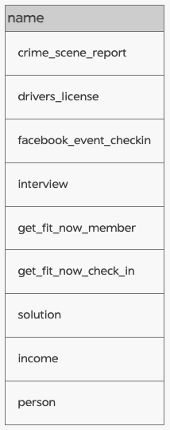

2. To find the structure of the `crime_scene_report` table
    ### Query:
      ```
      SELECT sql
      FROM sqlite_master
      WHERE name = 'crime_scene_report'
      ```
    ### Output:
    

## My steps:
1. Before I start querying the database, I want to get a better understanding of each of the table, particularly the `PRIMARY KEY`, `FOREIGN KEY`, and `REFERENCES`.
    ### Query:
      ```
      SELECT sql
      FROM sqlite_master
      ```
    ### Output:
    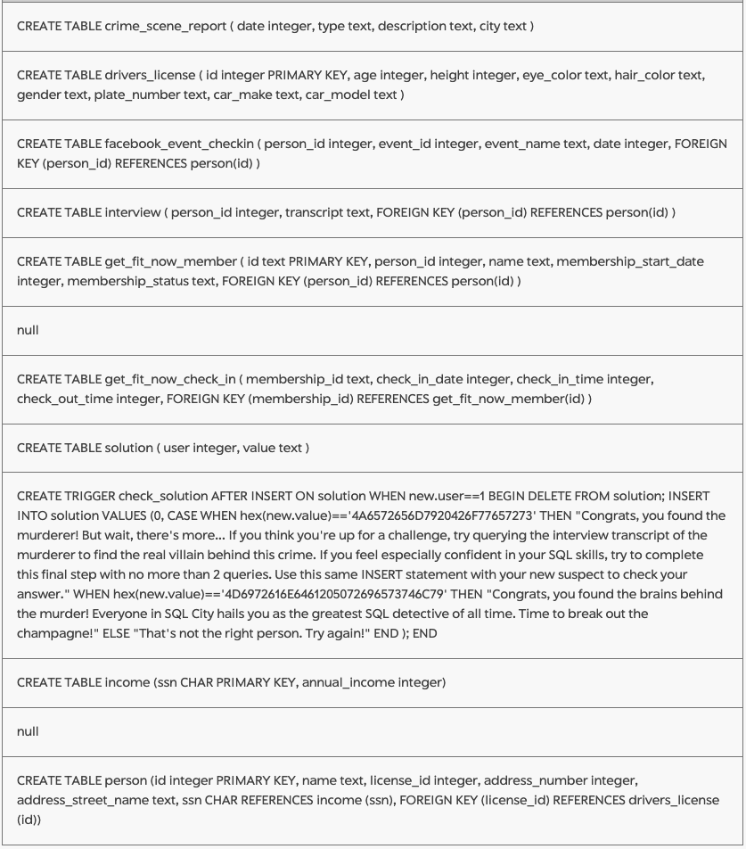
  
    It would also be helpful to take a look at the schema diagram to visually see how the tables are related to one another.
    ### Diagram:
    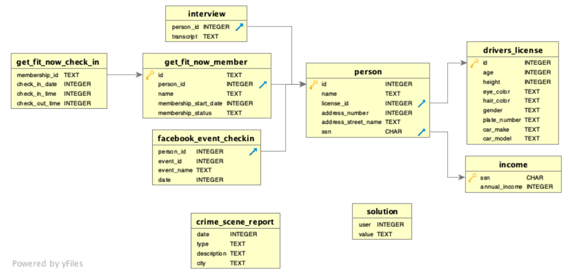
  
    Before I query the selected tables based on the criteria, I usually run below query on the table first to gain an idea of what the data in the table looks like so I can tailor my query to match the data in the table.
    ### Query:
    ```
    SELECT *
    FROM table_name
    LIMIT 5
    ```

2. Now I'm ready to get started! I know that 'the crime was a `​murder​` that occurred sometime on `​Jan.15, 2018`​ and that it took place in `​SQL City`', so I first queried the `crime_scene_report` table to find the relevant report.
    ### Query:
      ```
      SELECT *
      FROM crime_scene_report
      WHERE date = 20180115 AND city = 'SQL City' AND type = 'murder'
      ```
    ### Output:
    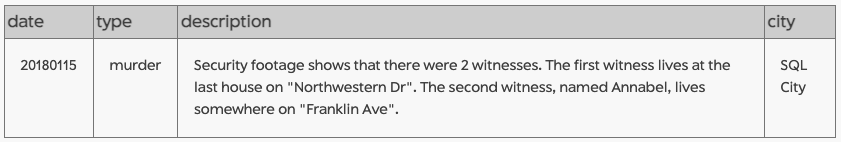

    Based on the description of the crime report, I know there are two witnesses. I have the first name of one of the witness and the street address of both witnesses.

3. Let's start with the witness named `Annabel` first by querying the `person` table based on the street name and the first name.
    ### Query:
      ```
      SELECT *
      FROM person
      WHERE address_street_name = 'Franklin Ave' 
        AND name LIKE 'Annabel%'
      ```
    ### Output:
    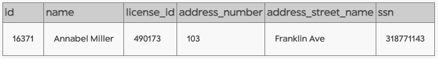
    
4. I can then use `Annabel`'s id from the `person` table to find the interview transcript from the `interview` table. For this query, I used a subquery within the main query to directly get `Annabel`'s id from the `person` table.
    ### Query:
      ```
      SELECT *
      FROM interview
      WHERE person_id = (SELECT id
                         FROM person
                         WHERE address_street_name = 'Franklin Ave' 
                          AND name LIKE 'Annabel%')
      ```
    ### Output:
    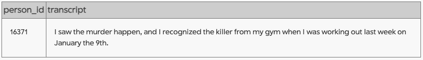
    
    Looks like `Annabel` identified the killer as someone from her gym and the killer went to the gym on January 9th.

5. Since the `get_fit_now_check_in` table does not include additional member information, I joined the `get_fit_now_check_in` table with the `get_fit_now_member` table to more easily identify the members that used the gym on January 9th.
    ### Query:
      ```
      SELECT *
      FROM get_fit_now_check_in AS ci
      JOIN get_fit_now_member AS mbr
      ON ci.membership_id = mbr.id
      WHERE ci.check_in_date = 20180109
      ```
    ### Output:
    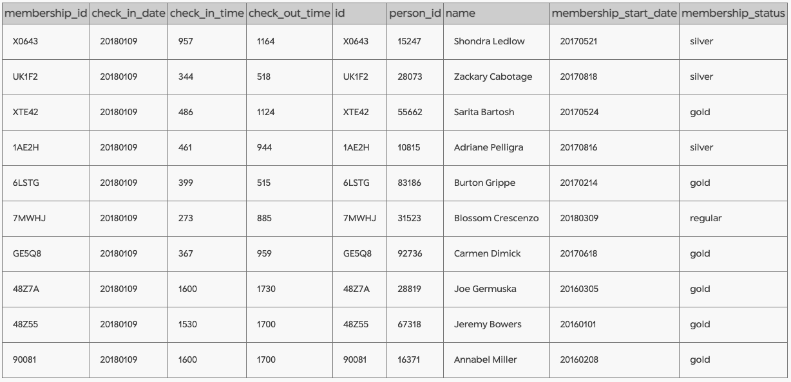
    
    We can see that `Annabel` indeed went to the gym on January 9th, as she claimed in the interview. The suspects would be the gym members that attended gym during the same period as `Annabel`.

6. To find the suspects that attended the gym during the same period as `Annabel`, I added on to the query from previous step to filter by the `check_in_time` and `check_out_time`. For the time period to overlap, they must have left the gym after `Annabel` entered and entered the gym before `Annabel` left. Since the tables are relatively small in this example, we can visually inspect the result from the previous query and confirm the result is reasonable. To make the query more readable, I try to use common table expressions (CTEs) for most of the queries that involved more than one subquery.
    ### Query:
      ```
      WITH gym_named AS (
        SELECT *
        FROM get_fit_now_check_in AS ci
        JOIN get_fit_now_member AS mbr
        ON ci.membership_id = mbr.id
        WHERE ci.check_in_date = 20180109
        ),
      annabel AS (
        SELECT *
        FROM gym_named
        WHERE check_in_date = 20180109 
          AND name LIKE 'Annabel%'
        )
      SELECT * 
      FROM gym_named
      WHERE check_out_time >= (SELECT check_in_time FROM annabel) 
        AND check_in_time <= (SELECT check_out_time FROM annabel)
      ```
    ### Output:
    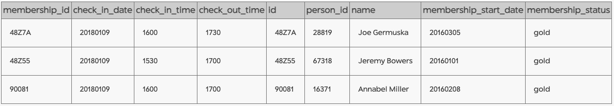

    We can identify two suspects, `Joe` and `Jeremy`.

7. Before moving on to finding out more information about the two suspects, let's identify the other witness and find out what the other witness has to say about the case first. I know the witness lives at the last house of `Northwestern Dr` so assuming the house numbers are in increasing order, we can find out the witness from the `person` table.
    ### Query:
      ```
      SELECT * 
      FROM person
      WHERE address_number = (SELECT MAX(address_number)
                              FROM person
                              WHERE address_street_name = 'Northwestern Dr')
        AND address_street_name = 'Northwestern Dr'
      ```
    ### Output:
    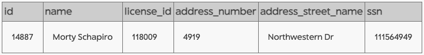

    We now know who the other witness is, we can find out what this witness said in their interview.

8. Similar to what was done for `Annabel`, I queried the `interview` table to find the interview transcript for `Morty`. Now we have two nested subqueries which makes the query a little hard to read, but since the logic here is pretty simple, I just left it as is.
    ### Query:
      ```
      SELECT *
      FROM interview
      WHERE person_id = (SELECT id
                         FROM person
                         WHERE address_number = (SELECT MAX(address_number)
                                                 FROM person
                                                 WHERE address_street_name = 'Northwestern Dr')
                           AND address_street_name = 'Northwestern Dr')
      ```
    ### Output:
    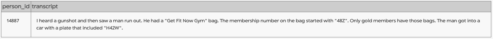

    From the transcript, we can confirm that the witness goes to the gym and is a gold member. We also know his membership number and his license plate number.

9. Let's now cross check the information `Morty` provided with the information we found out based on what `Annabel` provided. 
    ### Query:
      ```
      WITH gym_named AS (
        SELECT *
        FROM get_fit_now_check_in AS ci
        JOIN get_fit_now_member AS mbr
        ON ci.membership_id = mbr.id
        WHERE ci.check_in_date = 20180109
        ),
      annabel AS (
        SELECT *
        FROM gym_named
        WHERE check_in_date = 20180109 AND name LIKE 'Annabel%'
        )
      SELECT * 
      FROM gym_named
      WHERE check_out_time >= (SELECT check_in_time FROM annabel) 
        AND check_in_time <= (SELECT check_out_time FROM annabel)
        AND membership_status = 'gold'
        AND membership_id LIKE '48Z%'
      ```
    ### Output:
    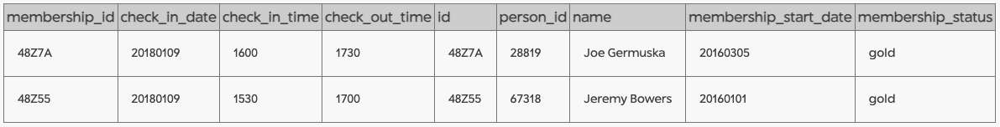

    Unfortunately, knowing the gym information did not help us narrow down the suspects as both `Joe` and `Jeremy` are `gold` members with `membership_id` starting with `48Z`. But at least we now know the `Annabel` is not a suspect.

10. Luckily, `Morty` gave us one more clue, which is the suspect's car license plate. We can find the `license_id` from the `person` table and then find the `plate_number` from the `drivers_license` table. Since the `drivers_license` table does not include the name of the person, I join the `drivers_license` table to the `person` table to create the `dl_named` table to easily identify the name of the killer.
    ### Query:
      ```
      WITH gym_named AS (
        SELECT *
        FROM get_fit_now_check_in AS ci
        JOIN get_fit_now_member AS mbr
        ON ci.membership_id = mbr.id
        WHERE ci.check_in_date = 20180109
        ),
      annabel AS (
        SELECT *
        FROM gym_named
        WHERE check_in_date = 20180109 
          AND name LIKE 'Annabel%'
        ),
      gym_suspects AS (
        SELECT *
        FROM gym_named
        WHERE check_out_time >= (SELECT check_in_time FROM annabel) 
          AND check_in_time <= (SELECT check_out_time FROM annabel)
          AND membership_status = 'gold'
          AND membership_id LIKE '48Z%'
        ),
      dl_named AS (
        SELECT ps.id AS person_id, ps.name, ps.license_id, ps.ssn, dl.* 
        FROM person AS ps
        JOIN drivers_license AS dl
        ON ps.license_id = dl.id
        )
      SELECT * 
      FROM dl_named
      WHERE person_id IN (SELECT person_id 
                          FROM gym_suspects)
        AND plate_number LIKE '%H42W%'
      ```
    ### Output:
    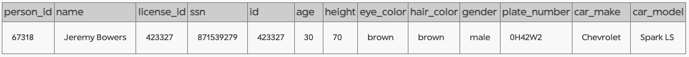

    Voila! 

11. After finding out the killer, I used the provided script to check my answers, and sure enough, I had correctly identified the killer. But wait there is more!
    ### Output:
    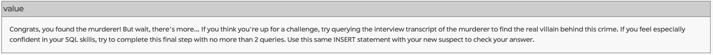
    
    So I made a small change to the previous query to find the transcript from the killer.
    ### Query:
      ```
      WITH gym_named AS (
        SELECT *
        FROM get_fit_now_check_in AS ci
        JOIN get_fit_now_member AS mbr
        ON ci.membership_id = mbr.id
        WHERE ci.check_in_date = 20180109
        ),
      annabel AS (
        SELECT *
        FROM gym_named
        WHERE check_in_date = 20180109 
          AND name LIKE 'Annabel%'
        ),
      gym_suspects AS (
        SELECT *
        FROM gym_named
        WHERE check_out_time >= (SELECT check_in_time FROM annabel) 
          AND check_in_time <= (SELECT check_out_time FROM annabel)
          AND membership_status = 'gold'
          AND membership_id LIKE '48Z%'
        ),
      dl_named AS (
        SELECT ps.id AS person_id, ps.name, ps.license_id, ps.ssn, dl.* 
        FROM person AS ps
        JOIN drivers_license AS dl
        ON ps.license_id = dl.id
        ),
      killer AS (
        SELECT * 
        FROM dl_named
        WHERE person_id IN (SELECT person_id 
                            FROM gym_suspects)
          AND plate_number LIKE '%H42W%'
        )
      SELECT *
      FROM interview
      WHERE person_id = (SELECT person_id 
                         FROM killer)
      ```
    ### Output:
    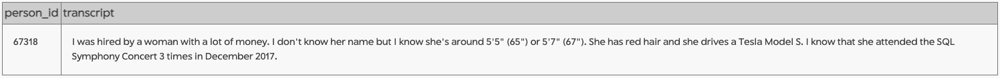

    Evidently, this was a hired murder! 😲 The killer's transcript provided very detailed description of the woman that hired him, so let's try to find out who the 'real' killer is!

12. We know that we are looking for someone who is 1) female, 2) has red hair, 3) drives Tesla Model S, 4) is around 65" - 67" tall, and attended the SQL Symphony Concert 3 times in December 2017. 
    
    I first identified the suspects from the `drivers_license` table matching the physical and car description of the suspect, joining the `drivers_license` table with the `person` table so the `person_id` can be easily queried and the `name` can be easily identified. 
    
    I then identified the relevant concerts from the `facebook_event_checkin` table, grouped the table by the `person_id` to find the number of attendance for each person to identify suspects that have attended the event 3 times. 
    
    Finally, the 'real' killer is the only suspect in both the `dl_suspects` and `concert_suspects` subquery tables.

    ### Query:
      ```
      WITH dl_suspects AS (
        SELECT ps.id AS person_id, ps.name, ps.license_id, ps.ssn, dl.* 
        FROM person AS ps
        JOIN drivers_license AS dl
        ON ps.license_id = dl.id
        WHERE dl.gender = 'female'
          AND dl.hair_color = 'red'
          AND dl.car_make = 'Tesla'
          AND dl.car_model = 'Model S'
          AND 65 <= dl.height <= 67
        ),
      concert AS (
        SELECT *
        FROM facebook_event_checkin
        WHERE 20171201 <= date <= 20171231
        AND event_name LIKE '%SQL Symphony Concert%'
        ),
      concert_suspects AS (
        SELECT person_id, COUNT(*) AS num_attendance
				FROM concert
				GROUP BY person_id
        HAVING num_attendance = 3
        )
      SELECT *
      FROM dl_suspects
      WHERE person_id IN (SELECT person_id 
                          FROM concert_suspects)
      ```
    ### Output:
    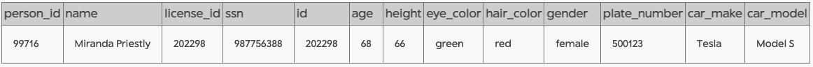

    At last! 🍾🍾🍾

    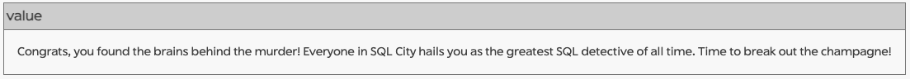
